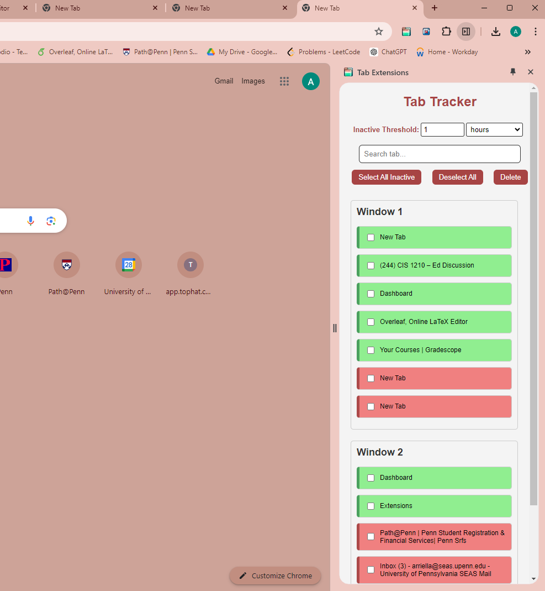
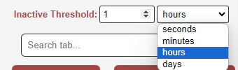
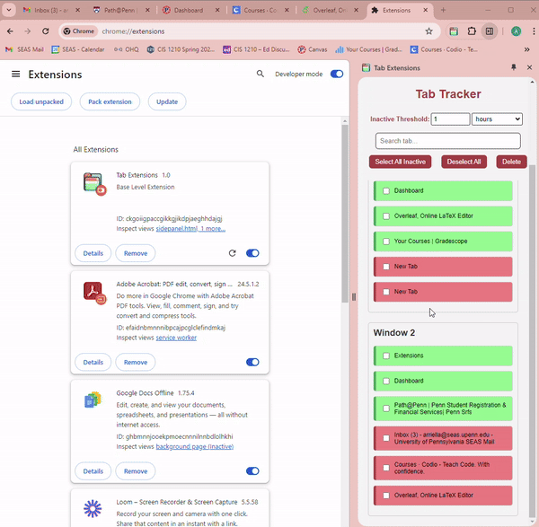
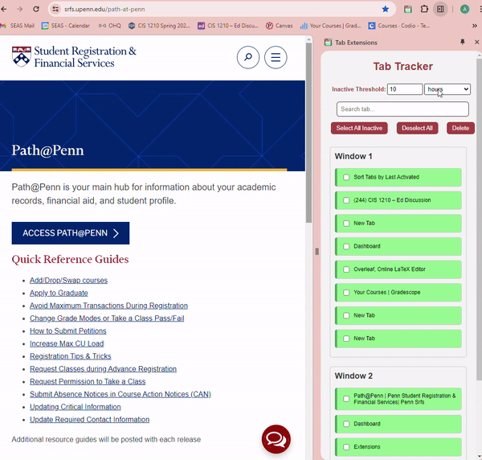
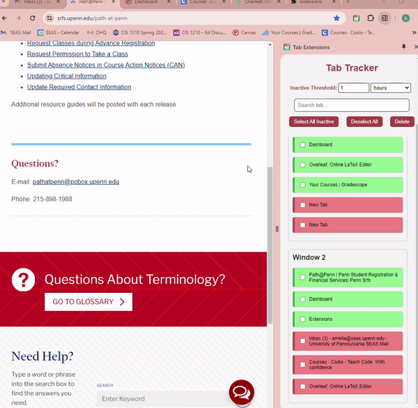
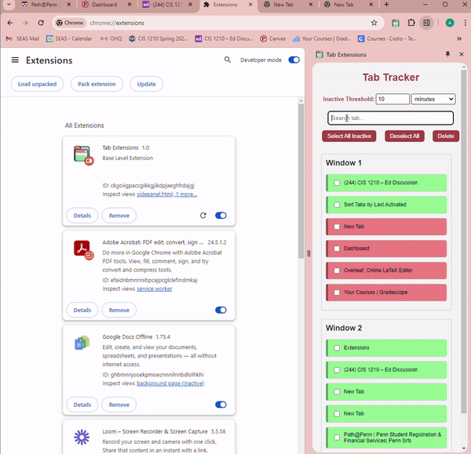

#  Tab Tracker Chrome Extension

Many people use Chrome to accomplish a variety of tasks such as work, communications, entertainment, and social media. 
A major problem today is that we forget to close inactive tabs when using the Internet. Moreover, when there are several
tabs open in the browser, navigating through different sites can be tedious. TabTracker allows us to closely monitor our 
usage of different web pages, mark out tabs for closure and allow for easy navigation between tabs and windows.

Link to TabTracker Hugo Landing Page [here](https://arriellam.github.io/hugo-tabtracker/)


## Installation and Setup

1. Clone this repository:
   ```bash
   git clone https://github.com/arriellam/s24-team-15.git
   ``` 
2. Open Google Chrome and go to `chrome://extensions/`.
3. Enable Developer mode using the toggle switch in the top right corner.
4. Click on the "Load unpacked" button.
5. Navigate to the directory where you cloned the repository and select the `s24-team-15` folder.
6. The extension should now be installed and visible in your Chrome browser's extensions list.
7. Make sure your sidePanel is enabled in Chrome.

## Features

- Display of tabs, sorted in increasing activity.
- Custom threshold input, can be in seconds, minutes, hours, days.
- All tabs passed the threshold are marked inactive (Red highlight).
- Synced with your browser: able to navigate between tabs and windows, and can delete tabs through the list.
- Bulk deletion of tabs who's inactivity is passed your desired threshold.
- Can search for tabs based on their URL or title.




## How to Use

[Here](https://www.youtube.com/watch?v=1fN54JEVHX4) is a link to a video description.

1. Open the Chrome Tab Tracker Extension by clicking the extension icon.


2. Set your desired threshold and time unit.
  


3. Navigate between tabs and windows in your browser by clicking the title of your desired tab in the list.



4. Tabs that have passed the threshold will be marked as inactive (red highlight), while the other are marked active (green highlight).
   You can customize the threshold to however many seconds, minutes, hours or days.
   


5. Try deleting individual tabs or bulk deleting tabs that have passed the threshold by clicking the "Select All Inactive" button, or manually clicking the checkbox of the tab you wish to delete, then click the delete button. You could always undo your selection by clicking the 'Deselect All' button.



6. Use the search functionality to find specific tabs by URL or title.



## Authors
- Arriella Mafuta (arriella@seas.upenn.edu)
- Maya Chari (mchari@sas.upenn.edu)
- Siddharth Kanderi (skanderi@seas.upenn.edu)

## Contributions and Suggestions
We welcome contributions and suggestions. Please open an issue or submit a pull request with your ideas.

## Licensing
This project is licensed under the MIT-License. You can read more about the MIT license [here](https://choosealicense.com/licenses/mit/).

